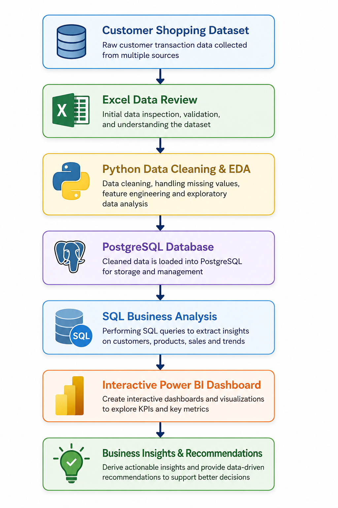

# 🛍️ Retail Customer Intelligence & Sales Analytics System

> **An End-to-End Retail Data Analytics Project using Excel, Python, PostgreSQL, SQL, and Power BI**


## 📌 Project Overview

The **Retail Customer Intelligence & Sales Analytics System** is an end-to-end data analytics project that demonstrates how customer shopping data can be transformed into meaningful business insights.

The project follows a complete analytics workflow, starting from data cleaning and preparation to SQL analysis and interactive dashboard development. It helps businesses understand customer purchasing behavior, identify sales trends, analyze product performance, and support data-driven decision-making.

This project showcases practical skills in **Excel, Python, PostgreSQL, SQL, and Power BI**, making it suitable for data analytics portfolios, academic projects, and placement preparation.


## 🎯 Business Objective

The main objective of this project is to analyze customer shopping behavior and answer the following business question:

> **How can customer shopping data be used to understand buying behavior, improve customer engagement, and support better business decisions?**


## 🚀 Project Workflow

The project follows an end-to-end data analytics workflow, starting from data collection to business insights.

<p align="center">
  
</p>


# 📂 Repository Structure

```
Retail-Customer-Intelligence-Sales-Analytics-System
│
├── Business Problem Document.pdf
├── Project Analysis Document.pdf
├── customer_shopping_behavior_dataset.csv
├── Python_Analysis.ipynb
├── SQL_Analysis.sql
├── Retail_Customer_Dashboard.pbix
├── README.md
└── Images
      ├── Dashboard.png
      └── Project Workflow.png
```


# 🛠️ Technologies Used

| Technology | Purpose |
|------------|---------|
| 📊 Microsoft Excel | Initial data review and validation |
| 🐍 Python | Data cleaning, preprocessing, feature engineering, and EDA |
| 🗄️ PostgreSQL | Database creation and SQL analysis |
| 💻 SQL | Business queries and customer analytics |
| 📈 Power BI | Interactive dashboard and business reporting |
| 📓 Jupyter Notebook | Python development environment |


# 📊 Dataset Information

| Attribute | Details |
|-----------|---------|
| Dataset Name | Customer Shopping Behavior |
| Total Records | 3,900 |
| Total Features | 18 |
| Domain | Retail Analytics |

### Dataset Includes

- Customer Demographics
- Product Information
- Purchase Details
- Payment Methods
- Shopping Frequency
- Discounts
- Subscription Status
- Review Ratings
- Shipping Details


# ⚙️ Project Stages

## 1️⃣ Data Preparation (Python)

- Imported the dataset using Pandas
- Cleaned missing values
- Renamed columns for consistency
- Created new features
- Performed Exploratory Data Analysis (EDA)
- Prepared the dataset for SQL analysis


## 2️⃣ Database Management (PostgreSQL)

- Connected Python with PostgreSQL
- Created database tables
- Loaded the cleaned dataset into PostgreSQL


## 3️⃣ Business Analysis (SQL)

Business questions answered include:

- Revenue by Gender
- Customer Segmentation
- Product Performance
- Discount Analysis
- Subscriber vs Non-Subscriber Analysis
- Shipping Performance
- Age Group Revenue
- Top Purchased Products
- Customer Loyalty Analysis
- High Spending Customers


## 4️⃣ Dashboard Development (Power BI)

Developed an interactive dashboard featuring:

- Sales Overview
- Customer Demographics
- Revenue Analysis
- Category Performance
- Customer Segmentation
- Subscription Analysis
- Discount Insights
- KPI Cards
- Interactive Filters


# 📈 Key Insights

- Customer purchasing behavior varies across age groups and product categories.
- Subscription members contribute significantly to total revenue.
- Discounts positively influence purchasing decisions for selected products.
- Loyal customers generate consistent business value.
- Product ratings help identify customer preferences.


# 💡 Business Recommendations

- Strengthen customer loyalty programs.
- Promote high-performing products.
- Design targeted marketing campaigns.
- Optimize discount strategies.
- Improve customer retention through personalized offers.


# 📷 Dashboard Preview

# 📁 Files Included

- 📄 Business Problem Document
- 📄 Project Analysis Document
- 📊 Customer Shopping Dataset
- 🐍 Python Analysis Notebook
- 🗄️ SQL Analysis Script
- 📈 Power BI Dashboard
- 📘 README


# ▶️ How to Run the Project

### 1. Clone the repository

```bash
git clone https://github.com/yourusername/Retail-Customer-Intelligence-Sales-Analytics-System.git
```

### 2. Install required libraries

```bash
pip install pandas numpy matplotlib seaborn sqlalchemy psycopg2-binary
```

### 3. Run the Jupyter Notebook

```
Python_Analysis.ipynb
```

### 4. Import the cleaned dataset into PostgreSQL

Execute the database connection code provided in the notebook.

### 5. Run SQL Queries

Execute the queries available in:

```
SQL_Analysis.sql
```

### 6. Open Power BI Dashboard

```
Retail_Customer_Dashboard.pbix
```


# 🎯 Skills Demonstrated

- Data Cleaning
- Exploratory Data Analysis
- Feature Engineering
- PostgreSQL Database Management
- SQL Query Writing
- Business Intelligence
- Dashboard Development
- Data Visualization
- Business Reporting


# 👩‍💻 Author

**Sanskruti Gharjale**

